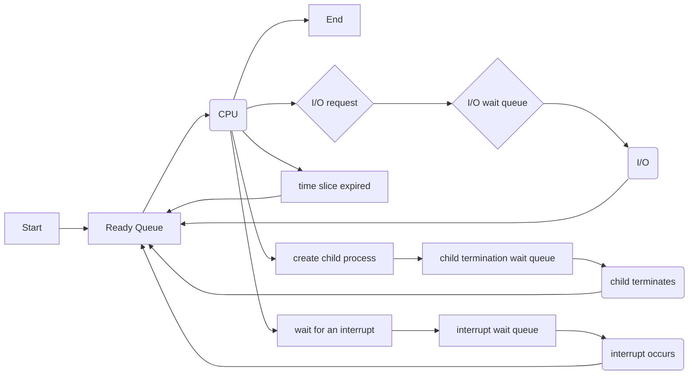

> 'Operating System Concepts \- 10th edition' 을
>  읽고 정리한 내용입니다.


# 3\.1 Process Concept


## 3\.1\.1 The Process


- Process : 실행 중인 프로그램
- 프로세스의 현재 활동 상태 ?
- **program counter** 값과 프로세서 레지스터의
 내용으로 나타내어짐
- 프로세스의 메모리 레이아웃은 다음과 같이 구성됨
- **Text section** : 실행 가능한 코드
- **Data section** : 전역 변수
- **Heap section** : 프로그램 런타임에 동적으로
 할당되는 메모리
- **Stack section** : 함수 파라미터, 리턴 주소,
 로컬 변수 등 함수 호출시 필요한 임시 데이터 저장 공간


```False
     _________________
max |                 |
    |     stack       |
    |_________________|
    |       |         |
    |       ↓         |
    |                 |
    |       ↑         |
    |_______|_________|
    |                 |
    |      heap       |
    |_________________|
    |                 |
    |      data       |
    |_________________|
    |                 |
    |      text       |
  0 |_________________|

```

- 텍스트 영역, 데이터 영역의 사이즈는 고정되어 런타임에
 변화하지 않는다.
- 스택 영역, 힙 영역은 프로그램 실행 도중에 동적으로
 변화할 수 있다.
- 함수가 호출될 때마다 함수 파라미터, 로컬 변수, 리턴 주소
 등을 포함한 **activation record** 가 스택
 영역에 push됨.
- 함수가 반환하면 스택 영역에서 pop됨
- 힙도 메모리 할당/반환에 따라 늘어나고 줄어든다.
- 스택, 힙은 서로를 향해 grow하지만 OS는 서로가 침범하지
 않도록 보장해야 한다.
- 프로그램은 하나의 수동적 엔티티(실행파일과 같은)
 개념이고, 프로세스는 능동적 엔티티(프로그램 카운터와
 관련된 리소스를 포함하는)
- 프로그램이 메모리에 적재되면 프로세스가 된다.
- 서로 다른 여러 프로세스가 동일한 프로그램으로부터 생성될
 수 있음. 텍스트 영역은 같을지라도 데이터/힙/스택 영역은
 서로 다를 것이다.
- 프로세스 자체가 코드를 실행할 수 있는 환경이 될 수도
 있음.
- ex) JVM


## 3\.1\.2 Process State


- 일반적으로 프로세스의 상태는 다음 중 하나에 속함 (네이밍은
 OS마다 다를 수 있음)
- **New** : 생성된 상태
- **Running** : 실행중
- **Waiting** : 이벤트 발생을 대기 (ex. I/O
 완료 or 시그널)
- **Ready** : 프로세서에 할당되는 것을 대기
- 하나의 프로세서 코어에서 실행(*running*)될 수 있는
 프로세스는 많아야 하나
 
```False
stateDiagram-v2

```


new \-\-\> ready : admitted


ready \-\-\> running : schduler dispatch


 running \-\-\> waiting : I/O or event wait  
running
 \-\-\> terminated : exit  
running \-\-\> ready :
 interrupt
 


waiting \-\-\> ready : I/O or event completion


```False

## 3.1.3 Process Control Block

- **process control block**(**PCB**) 또는 **task control block** 은 특정 프로세스와 연관된 여러 정보를 담고 있음
- Process state
- Program counter
- CPU registers
- Running 에서 interrupt 되면 PCB에 현재 레지스터 상태를 저장해둬야 한다.
- CPU-scheduling information
- 우선순위, 스케쥴링 큐의 포인터 등
- Memory-management information
- 동 프로세스와 연관된 주소 공간 등
- Accounting information
- CPU 사용량, 연관된 job 또는 process 갯수 등
- I/O status information
- 프로세스에 할당된 I/O 디바이스, 열려 있는 파일 목록 등

## 3.1.4 Threads

- 하나의 프로세스가 동시에 여러 태스크를 실행할 수 있게 함
- 여러 스레드가 병렬적으로 실행될 수 있기에 멀티코어 시스템에서 유리
- 스레드를 지원하는 경우 PCB에 스레드와 관련된 정보도 저장됨

# 3.2 Process Scheduling

- 멀티 프로그래밍 : 코어에서 항상 프로세스를 실행시킴으로써 유휴 자원을 줄이는 목적
- 시간 공유 : CPU 코어를 프로세스 사이에서 자주 전환시킴으로써 사용자가 실행 중인 프로그램과 상호작용할 수 있도록 하는 목적
- 두 목적을 위해 **process scheduler**가 코어에서 실행시키기에 적합한 프로세스를 선택하게 된다.
- 멀티 프로그래밍과 시간 공유 목적의 균형을 잡기 위해서는 프로세스가 I/O 집약적인지 CPU 집약적인지 잘 파악해야 한다.
- **degree of multiprogramming** : 메모리에 존재하는 프로세스의 수

## 3.2.1 Scheduling Queues

- 프로세스가 시스템에 진입하면 **ready queue**에 넣어지게 된다.
- ready queue에서는 CPU 코어에서 실행되는 것을 대기 중인 프로세스들이 존재한다.
- 큐는 링크드 리스트로 구현되어 있음
- 큐 헤더는 PCB를 가리키고 해당 PCB는 다음 순서의 PCB를 가리키고, and so on..
- **wait queue** 도 비슷한 형태
- 종종 **Queueing diagram**을 통해 프로세스 스케쥴링을 나타냄.



## 3\.2\.2 CPU Scheduling


- CPU 스케쥴러는 ready 큐에서 프로세스를 골라서 CPU 코어를
 할당한다.
- 보통은 CPU 집약적인 프로세스라고 더 긴 기간동안 코어를
 연속적으로 점유하게 두지는 않는다
- **swapping** : 메모리가 여유롭지 않은 경우
 메모리에서 프로세스를 뺐다가 필요한 경우에 다시 올릴 수도
 있음(degree of multiprocessing을 줄임)


## 3\.2\.3 Context Switch


- 인터럽트가 발생하면 OS는 CPU 코어가 현재 태스크 실행에서
 커널 루틴 실행으로 옮겨가도록 한다.
- 이러한 경우 시스템은 현재 CPU 코어에서 실행중인 프로세스
 **context**를 저장하여 추후 다시 실행할 수
 있도록 한다.
- 컨텍스트는 프로세스의 PCB로 나타내어진다.
- CPU 코어를 다른 프로세스로 스위칭하는 것은 현재 프로세스의
 **state save**와 다른 프로세스의
 **state restore**를 동반한다.
- 이를 **context switch**라고 부름
- 컨텍스트 스위칭을 할 때, 기존 프로세스 상태를 저장하고
 다른 프로세스 상태 완전히 불러오기까지 어느 정도의 시간이
 소요된다. 즉, CPU가 idle한 시간이 존재 (context switch
 time)
- 스위칭 시간은 메모리 속도, 복사해야 하는 레지스터 갯수,
 (모든 레지스터를 한 번에 load하거나 저장하는) 특수
 인스트럭션의 존재 여부 등 여러 요소에 따라 달라질 수 있다.
- 보통은 수 마이크로세컨드


# 3\.3 Operations on Processes


## 3\.3\.1 Process Creation


- 프로세스가 프로세스를 생성할 수 있음
- 생성 프로세스 \- parent 프로세스
- 생성된 프로세스 \- child 프로세스
- 프로세스의 식별자 \-
 **process identifier**(**pid**)
- 리눅스에서 `systemd` 프로세스(항상 pid 1\)는
 모든 유저 프로세스의 root parent 프로세스
- 부팅 시점에 `systemd` 프로세스는
 `ssh` 서버, `logind` 등 기본적인
 프로세스를 생성
- `fork()` : 자식 프로세스는 부모 프로세스의
 주소 공간을 그대로 복사
- `exec()` : 바이너리 파일을 메모리에 올려서
 호출하는 프로세스의 주소 공간을 덮어씌운다.


## 3\.3\.2 Process Termination


- 프로세스는 마지막 statement를 실행하고 나면 OS에게
 `exit()` 시스템 콜 호출을 통해 제거를 요청한다.
- 만약 부모 프로세스가 `wait()`을 통해 대기하고
 있는 상태라면 부모 프로세스에 상태 코드를 반환
- 모든 자원은 OS에 의해 반환된다
- 윈도우즈의 `TerminateProcess()` 와 같은 시스템
 콜을 통해서 외부에서도 프로세스를 종료시킬 수 있다.
- 임의의 유저 프로세스가 다른 프로세스를 함부로 종료시키는
 것을 막기 위해 보통은 부모 프로세스에게만 호출이 허용되어
 있다.
- 종료를 위해서는 자식 프로세스의 id를 알아야 하기 때문에 새
 프로세스 생성시 부모 프로세스에 id가 전달된다.
- 부모 프로세스가 자식 프로세스를 종료시키는 이유는
 여러가지가 있는데 그 중 몇 가지는 다음과 같다.
- 자식 프로세스의 리소스 사용량이 일정 수준을 초과한 경우
- 자식 프로세스에 할당된 태스크가 더 이상 필요하지 않은 경우
- 부모 프로세스가 종료된 상황에서 자식 프로세스가 계속
 진행하는 것을 OS가 허용하지 않는 경우
- 그러한 OS에서는 **cascading termination**을
 통해 모든 자식 프로세스들이 종료됨
- 프로세스 종료 시 리소스는 OS에 의해 반환되지만 프로세스
 테이블 상의 엔트리는 부모 프로세스가 `wait()`을
 호출하기 전까지 남아 있다. (프로세스 테이블에는 프로세스의
 종료 코드가 담겨 있다)
- 종료되었지만 부모 프로세스가 `wait()`을
 호출하지 않은 프로세스는
 **zombie** 프로세스라 부른다.
- 일반적인 상황에서 `wait()` 호출 전까지 찰나의
 시간동안 좀비 프로세스 상태를 거친다.
- 호출 이후에는 프로세스 테이블에서 엔트리가 해제된다.
- 부모 프로세스가 `wait()`을 호출하지 않았는데
 반대로 먼저 종료하는 경우 자식 프로세스는
 **orphans**가 된다.
- 전통적인 UNIX 시스템은 `init` 프로세스가 새
 부모가 되어 `wait()`을 호출하도록 하여 종료
 상태를 확인하고 프로세스 테이블 엔트리에서 orphan
 프로세스의 id가 해제되도록 한다.
- 리눅스에서는 `systemd`가
 `init` 프로세스를 대체하도록 했기 때문에
 `systemd`가 같은 역할을 할 수도 있다. 하지만 또
 다른 프로세스가 그 역할을 하도록 하는 경우도 있다.


# 3\.4 Interprocess Communication


- 프로세스 간 협력할 수 있는 환경을 제공하는 이유
- 정보 공유
- 동일한 정보에 관심이 있는 경우가 있음(ex. copying \&
 pasting)
- 연산 속도 증가
- Divide \& Conquer
- 멀티 프로세싱 코어가 있는 경우에만 효용 존재
- 모듈화
- 시스템을 모듈 관점으로 구성해서 시스템 기능을 여러
 프로세스나 스레드로 나누는 경우
- 프로세스 협력을 위해서는 **IPC**(**interprocess communication**)이 필요
- 프로세스 간 데이터를 주고받는 메커니즘
- IPC의 두 가지 주요 메커니즘
- **shared memory**
- 협력 프로세스 간에 공유되는 메모리 구역에 데이터를 읽고
 씀으로써 커뮤니케이션
- 메시지 패싱처럼 시스템 콜을 호출할 필요가 없기에 더
 빠르다는 장점
- **message passing**
- 서로 메시지를 주고 받는 방식
- 컨플릭트를 고려할 필요가 없다는 장점
- 분산 시스템에서 구현하기 더 쉽다는 장점


# 3\.5 IPC in Shared\-Memory Systems


- 하나의 프로세스가 자신의 주소 영역에 공유 메모리 영역을
 생성
- 협력하려는 다른 프로세스가 이 영역에 붙고자 하고, 두
 프로세스가 서로 동의하면 IPC 시작
- 공유 영역에 쓰기/읽기를 함으로써 데이터를 주고 받음.
- 기존의 메모리 접근과 동일
- OS가 충돌을 중재해주지 않으므로 적절한 프로토콜을 통해
 읽기/쓰기가 충돌하지 않도록 해야 한다.
- 프로듀서\-컨슈머 문제가 하나의 예시
- 프로듀서는 데이터 생성, 컨슈머가 데이터를 소비 (ex. 서버 \-
 클라이언트)
- 프로듀서 \- 컨슈머 문제를 공유 메모리를 통해 풀 수 있음.
- 공유 영역에 버퍼를 두어 프로듀서가 채우고 컨슈머가 비우는
 방식.
- **unbounded buffer**와
 **bounded buffer**로 나눠 볼 수 있음
- 전자의 경우 프로듀서가 대기 없이 데이터를 쓸 수 있음.
- 후자의 경우 버퍼가 꽉 차면 프로듀서도 대기해야 할 수 있음.
- 버퍼는 다음과 같이 작성할 수 있다.


```False
#define BUFFER_SIZE 10

typedef struct {
  ...
} item;

item buffer[BUFFER_SIZE];
int in = 0;
int out = 0;
```

- `in`은 다음 빈 포지션을 가리키고
 `out`은 가장 첫 비어 있지 않은 포지션을
 가리킴
- `in == out` 이면 버퍼는 비어 있고,
 `((in + 1) % BUFFER_SIZE) == out` 이면 버퍼는
 꽉 찬 상태
- 프로듀서 코드


```False
item next_produced;

while (true) {
/* produce an item in next_produced */
while (((in + 1) % BUFFER_SIZE) == out)
; /* do nothing */

buffer[in] = next_produced;
in = (in + 1) % BUFFER_SIZE;
}
```

- 컨슈머 코드


```False
item next_consumed;

while (true) {
while (in == out)
; /* do nothing */

next_consumed = buffer[out];
out = (out + 1) % BUFFER_SIZE;

/* consume the item in next_consumed */
}
```

# 3\.6 IPC in Message\-Passing Systems


- Message passing : 주소 공간을 공유하지 않고 통신 및
 동기화를 할 수 있는 메커니즘
- 메모리 공유를 하기 힘든 분산 환경에서 특히 유용한 방식
- `send(message)`와
 `receive(message)`의 두 오퍼레이션으로 이루어짐
- 메시지 크기를 고정시키면 시스템 구현은 쉬워지지만
 프로그래밍 작업은 어려워짐. 메시지 크기가 가변적이면
 시스템 구현은 복잡해지지만 프로그래밍 작업은 간편해짐
 \=\> 트레이드오프
- 물리적인 연결은 뒤로 하고 논리적인
 *커뮤니케이션 링크*를 구현함에 있어서 다음의
 고려사항이 존재
- 직접 커뮤니케이션 or 간접 커뮤니케이션?
- 동기 커뮤니케이션 or 비동기 커뮤니케이션?
- 자동 버퍼링 or 묵시적 버퍼링?


## 3\.6\.1 Naming


- '어디'에 보낼 것인지에 대한 문제
- 즉, 직접적으로 소통할 것인지 매개체를 거쳐서 간접적으로
 소통할 것인지와 같은 문제
- **direct communication**
- 송신 프로세스 or 수신 프로세스를 명시해야 한다(must
 explicitly name the recipient or sender of the
 communication)
- *symmetry* in addressing
- `send(P, message)` \- 프로세스 `P`에
 `message` 전송
- `receive(Q, message)` \- 프로세스
 `Q`에 `message` 전송
- 특징 :
- 커뮤니케이션 원하는 두 프로세스 간에 link가 자동적으로
 수립됨. 서로 identity만 알고 있으면 됨
- 하나의 link는 오직 두 프로세스하고만 연관됨
- 두 프로세스 사이에는 하나의 link만 존재
- **asymmetry** in addressing
- `send(P, message)` \- 프로세스 `P`에
 `message` 전송
- `receive(id, message)` \- 어떤 프로세스로부터도
 `message`를 받을 수 있음. 변수
 `id`는 커뮤니케이션이 이루어진 프로세스의
 이름으로 할당된다.
- direct communication의 단점 \- 관련된 프로세스 정의에 대한
 모듈화가 부족
- 프로세스 식별자를 수정하면 참조하는 부분을 모두 찾아
 고쳐야 함
- **indirect communication**
- *mailbox*, or **ports**로부터 메시지를
 주고 받음
- 메일박스는 프로세스가 메시지를 놓을 수 있고 지울 수 있는
 객체의 추상화로 보면 된다.
- 두 프로세스는 동일한 메일박스를 통해 커뮤니케이션 가능
- `send(A, message)` \- 메일박스 `A`로
 `message` 전송
- `receive(A, message)` \- 메일박스
 `A`에서 `message` 수신
- 특징 :
- 두 프로세스가 동일한 메일박스를 공유하고 있을 때만 link가
 수립됨
- link가 두 개를 초과하는 프로세스와 연관될 수 있음
- 두 프로세스 사이에 여러 link가 존재할 수 있다. 이 때 각
 link는 하나의 메일박스에 해당
- 세 개의 프로세스가 메일박스를 공유하는 경우 다음 케이스
 가능 (프로세스1만 메시지 전송)
- 하나의 link에 최대 두 개 프로세스까지만 허용
- 한 번에 하나의 프로세스만 `receive()` 호출 허용
- 시스템이 어떤 프로세스가 메시지를 받을지 알고리즘을 통해
 선택
- 메일박스의 위치도 결정 필요
- 프로세스(의 메모리) 안에 메일박스를 생성하는 경우
- 주인은 메시지를 받기만 하고, 사용자는 메시지를 보내기만
 하도록 한다.
- OS가 관리하는 경우
- 특정 프로세스에 붙어 있지 않음
- 메일박스 생성, 메시지 전송/수신, 메일박스 제거의
 오퍼레이션을 제공해야 함
- 메일박스를 생성하는 프로세스가 소유주가 됨
- 소유주만 메시지 수신 가능
- 시스템 콜을 통해 권한 부여 가능 (하나의 메일박스에 여러
 수신자 가능)


## 3\.6\.2 Synchronization


- `send()`와 `receive()` 는
 **blocking**으로 구현할 수도,
 **nonblocking**으로 구현할 수도 있음
 (책에서는 a.k.a **synchronous** or
 **asynchronous** 로 서술)
- Blocking send
- 메시지 전송 프로세스는 수신자(or 메일박스)에 메시지가
 도달할 때까지 블락된다.
- Nonblocking send
- 전송 프로세스는 메시지를 보낸 후 다시 오퍼레이션을 재개
- Blocking receive
- 수신자는 메시지를 받을 때까지 블락된다.
- Nonblocking receive
- 수신자는 유효한 메시지를 받거나 null을 받는다.
- 다양한 조합이 가능
- 만약 수신자, 발신자 모두 블락킹 오퍼레이션을 사용한다면
 수신자와 발신자 사이에
 **rendezvous**(랑데뷰)를 갖는다고 부른다.


## 3\.6\.3 Buffering


- 통신하는 프로세스 사이에 주고받는 메시지는 임시 큐에
 잠깐이라도 머물게 된다.
- 큐는 세 가지 방향으로 구현 가능
- Zero capacity
- 큐의 길이는 0
- link에 대기하는 메시지가 존재할 수 없음.
- 전송자는 수신자가 메시지를 받을 때까지 블럭되어야 한다.
- Bounded capacity
- 큐의 길이는 유한한 값 $n$
- link capacity가 차지 않은 경우 새 메시지는 큐에 쌓이고
 전송자는 작업을 재개할 수 있다.
- link capacity가 꽉 차면 전송자는 큐에 공간이 생길 때까지
 블럭되어야 한다.
- Unbounded capacity
- 큐의 길이가 무한
- 대기 가능한 메시지 갯수도 무한
- 전송자가 블락될 일이 없음
- Zero capacity를 No buffering, Bounded capacity와 Unbounded
 capacity를 automatic buffering으로 부른다.


# 3\.7 Examples of IPC Systems


- POSIX Shared Memory
- Pipes
- Ordinary Pipes
- Named Pipes


# 3\.8 Communication in Client\-Server Systems


- Sockets
- Remote Procedure Calls (RPCs)
